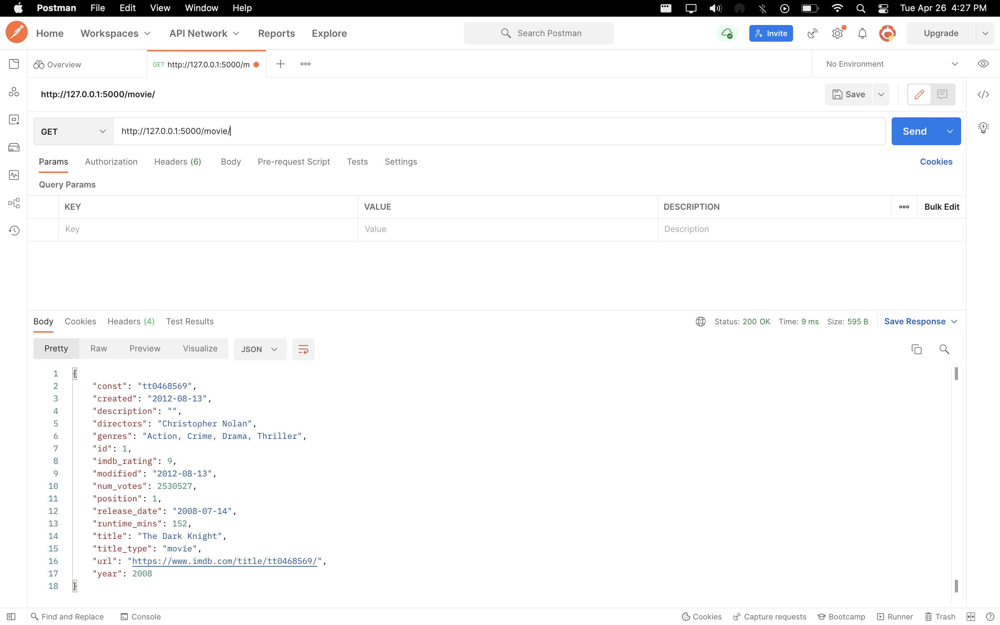
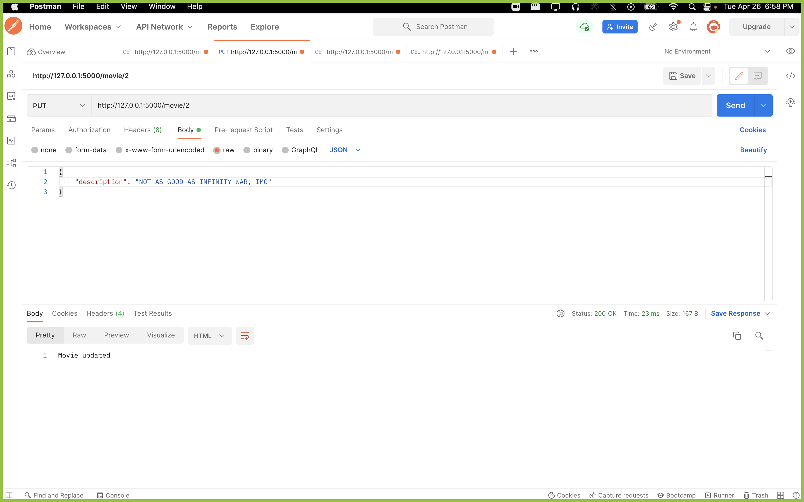
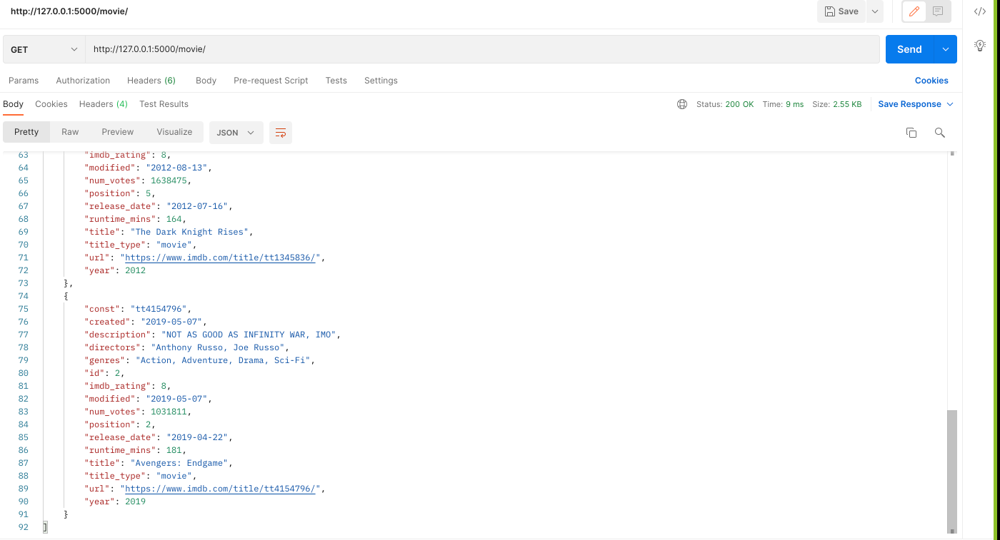
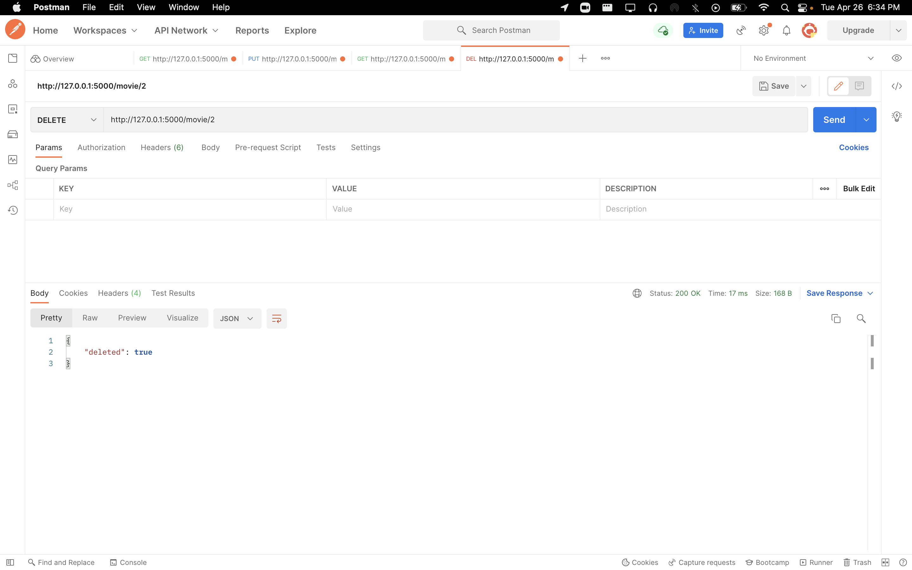

# Python-Flask-Project

An API of superhero movies built in Python and Flask, using a SQL database with PeeWee models with full CRUD.

---

## API Endpoints

|   Description    |   Endpoints   | Operators |
| :--------------: | :-----------: | :-------: |
| List all movies  |   `/movie`    |   `GET`   |
| Find movie by id | `/movie/<id>` |   `GET`   |
| Add a new movie  |   `/movie`    |  `POST`   |
|  Update a movie  | `/movie/<id>` |   `PUT`   |
|  Delete a movie  | `/movie/<id>` | `DELETE`  |

## CRUD in action

---

### GET

---

### UPDATES

---

### DELETING

